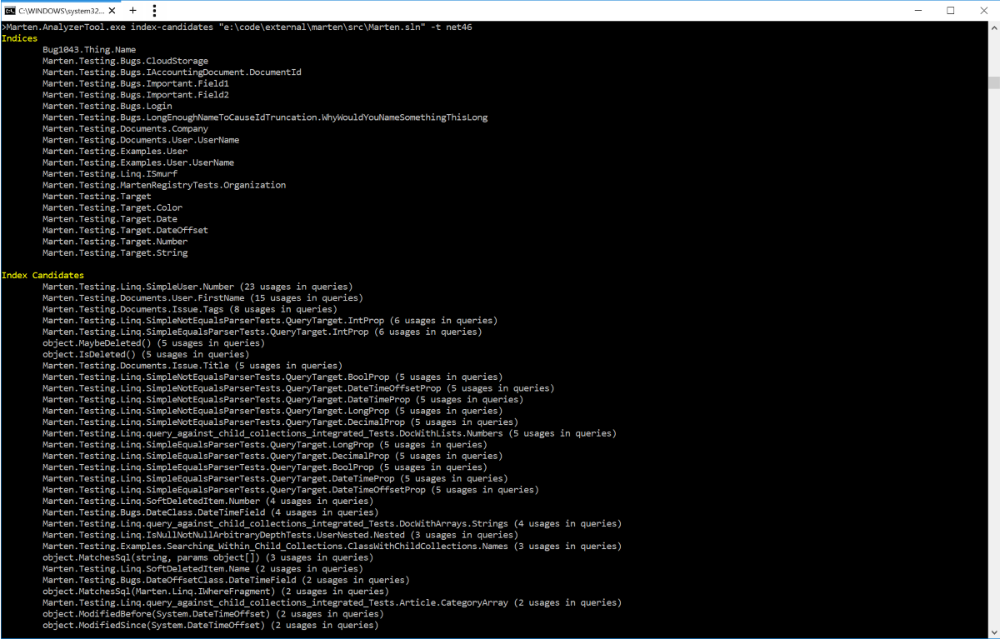
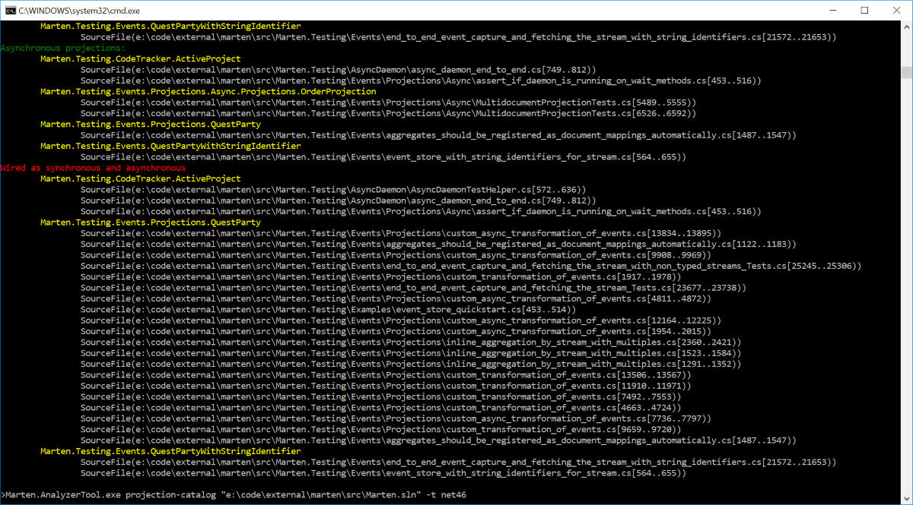

# Marten.AnalyzerTool

Tool for analyzing codebases using Marten.

This tool is built to supplement [Marten.Analyzers](https://jokokko.github.io/marten.analyzers/) and to aid reviewing codebases using Marten. It makes use of Roslyn code analyzers that maintain some state over solutions and projects.

Available functionality:
- Build a list of configured indices and index candidates
    - Display queried properties in query usage frequency
- Build a catalog of projections wired up in provided solution(s)
    - Display sites where the projections are wired up
    - Categorize projections as synchronous and asynchronous
    - Display projections wired as both, synchronous and asynchronous, i.e. projections that can race*

*In such configuration, competing updates can lead to data loss. Synchronous single stream projections can safely be wired in multiple store instances (e.g. in separate processes), as long as versioned methods of the `IEvenStore` are used (see [Marten docs](http://jasperfx.github.io/marten/documentation/events/appending/)).

Note: This is a contributor project.